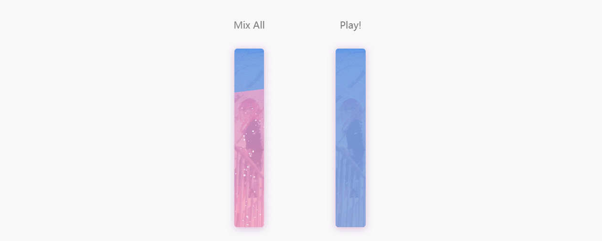

# SODA
A beautiful css animation demo & playground with strong summer atmosphere inspired by SODA🍸  :D

Check the [Online Demo](https://soda-ten.vercel.app/).

## Setup

Run on you localhost.

```bash
# pnpm
pnpm install
pnpm run dev
```

## Production

Build the application for production:

```bash
# pnpm
pnpm install
pnpm run build

# then preview
pnpm run preview
```

Check out the [deployment documentation](https://nuxt.com/docs/getting-started/deployment) for more information.

## LICENSE
Codes, without images resources is licensed by [GLWTPL](https://github.com/cfdxkk/SODA/blob/main/LICENSE).  
Image resources come from the internet.

